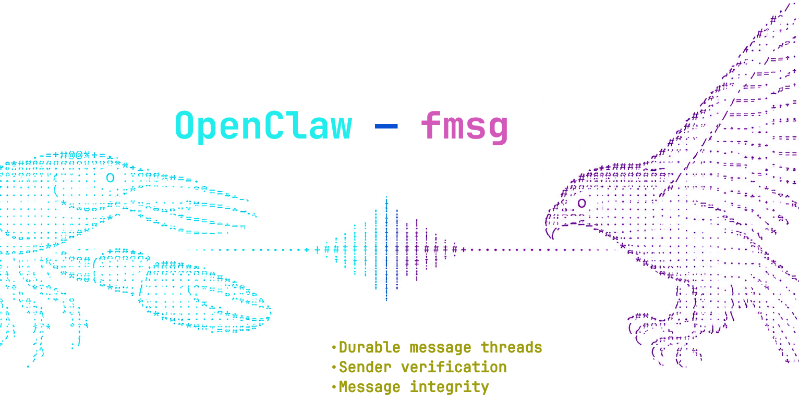

# OpenClaw-fmsg

[](https://github.com/markmnl/openclaw-fmsg/actions/workflows/tests.yml)
[](https://openclaw.ai)
[](https://nodejs.org)
[](./LICENSE)

<picture>
  <source media="(prefers-color-scheme: dark)" srcset="./docs/OpenClaw-fmsg.png">
  <source media="(prefers-color-scheme: light)" srcset="./docs/OpenClaw-fmsg-light.png">
  
</picture>

Connect [OpenClaw](https://openclaw.ai) to [fmsg](https://fmsg.org), the federated messaging protocol. The plugin receives messages over WebSocket, catches up after reconnects, preserves fmsg message trees as native OpenClaw sessions, and carries attachments in both directions.

## Highlights

- Native threaded sessions: roots start sessions, linear replies continue them, and sibling branches fork with direct ancestry as context.
- Reliable delivery: WebSocket push, inbox catch-up, deduplication, JWT refresh, and reconnect backoff.
- Safe by default: deny-by-default inbound access, `no_reply` enforcement, loop protection, and outbound credential redaction.
- Full conversations: reply-all participant handling, attachment transfer, and chained replies within an agent turn.
- Proactive messaging: the bundled `fmsg_send` tool can continue a one-to-one thread or start a new root.

## Compatibility

| Component | Supported |
|---|---|
| OpenClaw | `2026.8.1` or newer |
| Node.js 22 | `22.22.3` or newer |
| Node.js 24 | `24.15.0` or newer |
| Node.js 25 | `25.9.0` or newer |
| Package format | TypeScript source plus prebuilt ESM JavaScript |

## Quick start

```bash
openclaw plugins install npm:@markmnl/openclaw-fmsg
```

The published package contains TypeScript source for linked development and prebuilt JavaScript for managed installs. It has no install-time build hook and is compatible with OpenClaw/npm dependency installation using `--ignore-scripts`.

Set the API key in the gateway environment, then add `channels.fmsg` to `openclaw.json`:

```bash
export FMSG_API_KEY='fmsgk_...'
```

```json
{
  "channels": {
    "fmsg": {
      "enabled": true,
      "apiUrl": "https://api.fmsg.io",
      "homeChannel": "@owner@example.com",
      "allowedUsers": ["@owner@example.com"],
      "allowAllUsers": false,
      "maxAgentTurnsPerThread": 8,
      "agentTurnWindowMs": 60000
    }
  }
}
```

Restart the gateway. A successful WebSocket connection logs:

```text
fmsg connected
```

The sender address is always read from the exchanged JWT's `sub` claim. `homeChannel` is not a from-address.

## Configuration

Environment values take precedence over `channels.fmsg`.

| Configuration | Environment | Default | Purpose |
|---|---|---:|---|
| `apiUrl` | `FMSG_API_URL` | `https://api.fmsg.io` | fmsg Web API base URL |
| `apiKey` | `FMSG_API_KEY` | — | `fmsgk_...` credential exchanged for short-lived JWTs |
| `homeChannel` | `FMSG_HOME_CHANNEL` | — | Owner address and fallback sole allowlist entry |
| `allowedUsers` | `FMSG_ALLOWED_USERS` | `[]` | Allowed inbound senders; environment form is comma-separated |
| `allowAllUsers` | `FMSG_ALLOW_ALL_USERS` | `false` | Explicitly allow every valid fmsg sender |
| `maxAgentTurnsPerThread` | `FMSG_MAX_AGENT_TURNS_PER_THREAD` | `8` | Automatic OpenClaw turns allowed per branch/window; `0` disables |
| `agentTurnWindowMs` | `FMSG_AGENT_TURN_WINDOW_MS` | `60000` | Sliding circuit-breaker window in milliseconds |
| `mediaMaxBytes` | — | `10485760` | Maximum bytes per inbound/outbound attachment |

Access is default-deny:

- A non-empty `allowedUsers` list is enforced case-insensitively.
- An empty list with `homeChannel` configured uses that address as the effective sole allowlist and logs a warning.
- With neither value configured, all inbound messages are rejected with a clear warning.
- `allowAllUsers: true` is the only open-access setting.

## Thread and session mapping

fmsg is a message tree. OpenClaw is given the fmsg branch ID as native `threadId` and the direct parent message as `replyToId`.

| fmsg event | OpenClaw branch/thread ID | Result |
|---|---|---|
| Root `R` from counterparty `C` | `R` | New counterparty session |
| First child on the line from `R` | inherited `R` | Continues that session |
| Later sibling `M` under root `R` | `R:br:M` | New session with direct ancestry context |
| Descendant of `M` | inherited `R:br:M` | Continues the branch session |

A native key has this shape:

```text
agent:<agentId>:fmsg:direct:<counterparty>:thread:<root-or-branch>
```

The first discovered child continues its parent's session; later discovered siblings fork. Catch-up is processed oldest-first, making this chronological during normal delivery. Fork context contains only the bounded root-to-parent `pid` chain—never sibling history—and is explicitly labelled as untrusted content.

Outbound replies:

- Reply to the direct parent message.
- Reply-all to `from`, `to`, every `add_to_from`, and every `add_to.to` on that parent, excluding the JWT sender.
- If one OpenClaw turn emits several messages, the first replies to the inbound and each subsequent message replies to the preceding outbound message.
- A new inbound resets that output chain.
- Agent-initiated continuation selects only the latest strict one-to-one thread with the address. It never auto-selects a multi-party thread.

## Agent tool

The plugin registers `fmsg_send`:

```json
{
  "to": "@alice@example.net",
  "text": "Status update",
  "fmsg_new_thread": false,
  "topic": "Optional topic for a new root"
}
```

By default it continues the latest strict one-to-one thread. Set `fmsg_new_thread` to force a new root.

## Safety behavior

- `no_reply` inbound messages are recorded and marked read without starting an automatic agent turn.
- `important` is exposed as `FmsgImportant` in OpenClaw's inbound context. `no_reply` is retained in the fmsg routing record and audit log, then hard-suppressed before model dispatch.
- The loop circuit breaker counts one successful automatic OpenClaw turn, not individual chunks. Inbound messages do not reset it. On the final allowed turn, outbound messages carry `no_reply`; further turns are suppressed until timestamps leave the sliding window.
- Operators can tune both circuit-breaker values or set `maxAgentTurnsPerThread: 0` to rely entirely on agent discretion.
- Inbound bodies, ancestry, topics, addresses, and filenames are untrusted.
- `fmsgk_...` and compact JWT-shaped strings are redacted immediately before any outbound text is drafted and from plugin error logs.

Runtime routing state is stored under OpenClaw's state directory in `fmsg/<account>.json`, with bounded message and deduplication history.

## Development

```bash
npm install --ignore-scripts
npm run typecheck
npm test
npm run build
npm pack --dry-run
```

## Releasing

Stable releases are published to npm by `.github/workflows/publish.yml` when a GitHub Release is published. Use a stable semantic-version tag such as `v0.1.1`; the workflow derives the npm version from the tag and updates both `package.json` and `package-lock.json` in the release checkout before publishing. Build and commit `dist/` whenever source code changes before creating the release.

The npm package must configure a trusted GitHub Actions publisher for repository `markmnl/openclaw-fmsg`, workflow `publish.yml`, with `npm publish` allowed. The workflow uses short-lived OIDC credentials and does not require an npm token secret.

The unit suite runs an in-memory HTTP and WebSocket implementation of the fmsg Web API. It covers JWT exchange/refresh, drafts and attachments, WebSocket plus inbox catch-up, access control, branch mapping, native session routing, reply-all, output chaining, proactive one-to-one continuation, flags, secret redaction, persistence, and the circuit breaker.

### Live OpenClaw gateway acceptance

The opt-in gateway test launches the installed OpenClaw executable with a deterministic local model and the in-memory fmsg Web API. It verifies the ready connection, root and branch session rows in OpenClaw's SQLite session store, first-child continuation, and reply-all:

```bash
npm run test:gateway
```

Set `OPENCLAW_E2E_ROOT` to an OpenClaw package directory when it is not available at `node_modules/openclaw`. Set `OPENCLAW_E2E_PLUGIN_ROOT` to exercise a particular installed copy of this package instead of the working tree.

### fmsg-docker e2e

The opt-in e2e test expects two provisioned identities in an already-running [fmsg-docker](https://github.com/markmnl/fmsg-docker) environment:

```bash
FMSG_E2E=1 \
FMSG_E2E_AGENT_API_URL=http://localhost:8181 \
FMSG_E2E_AGENT_API_KEY='fmsgk_...' \
FMSG_E2E_PEER_API_URL=http://localhost:8182 \
FMSG_E2E_PEER_API_KEY='fmsgk_...' \
npm run test:e2e
```

The addresses are derived from the JWTs. The test sends a root with an attachment, observes WebSocket delivery, downloads the attachment, replies through the second deployment, and verifies the reply's `pid`.

## License

MIT
